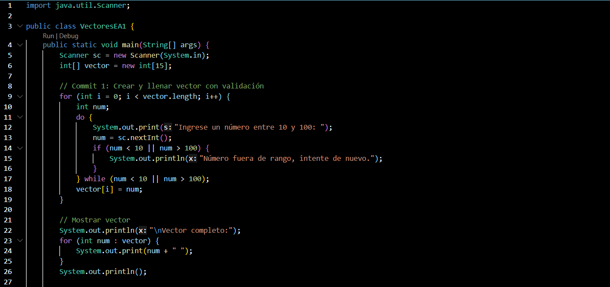
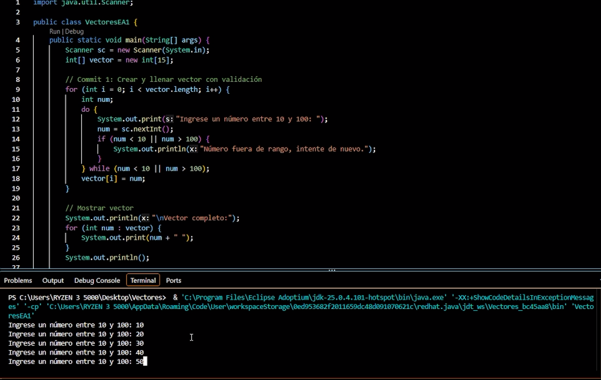
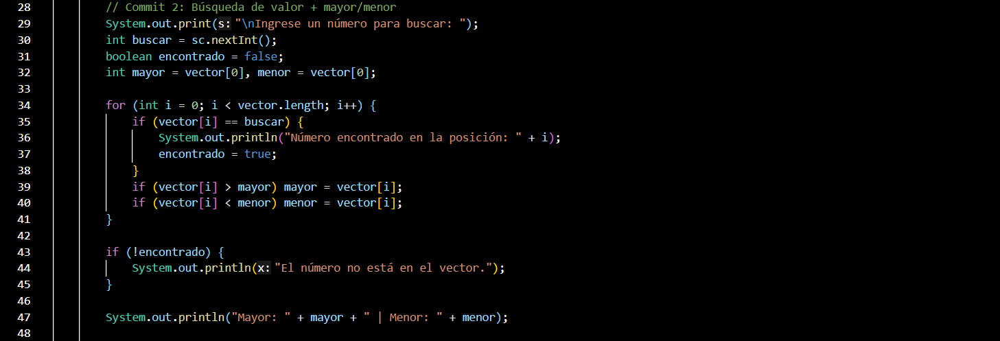
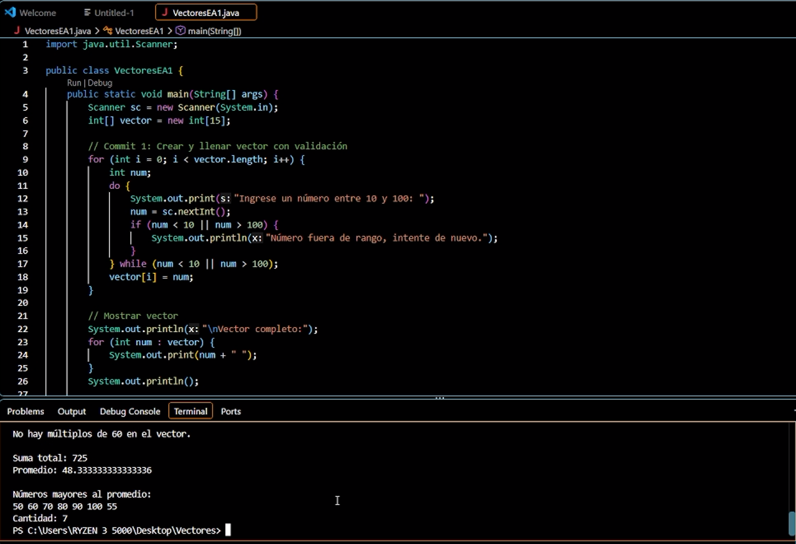
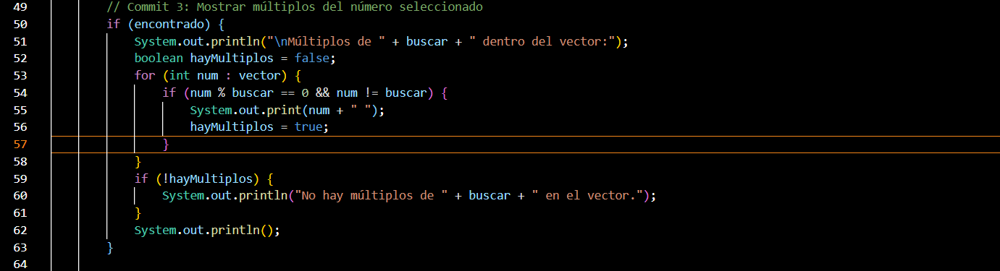
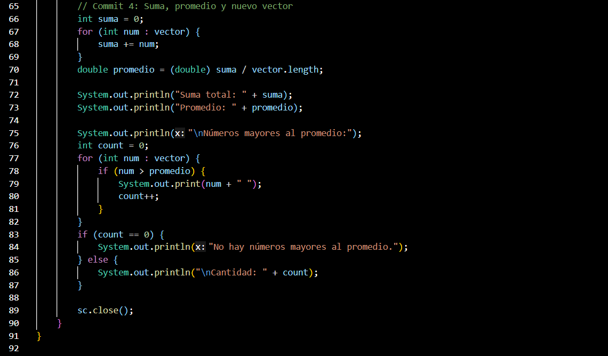
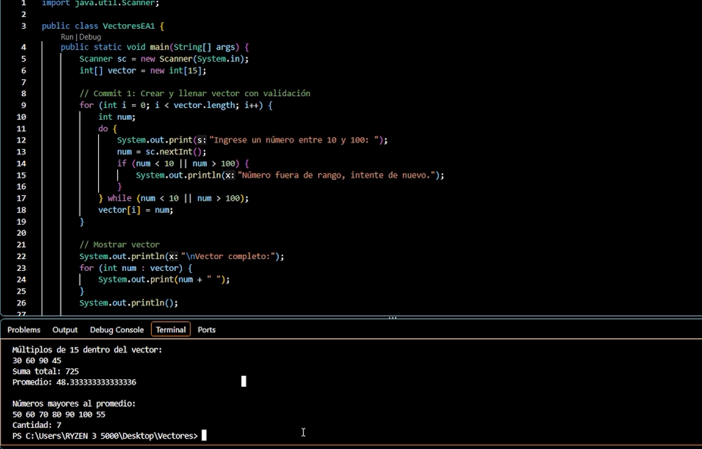

# Evidencia de Aprendizaje 1 - Vectores en Java

## 🎯 Objetivo
Desarrollar un programa en Java que:
1. Cree y valide un vector de 15 números entre 10 y 100.
2. Permita buscar un número en el vector y mostrar mayor/menor.
3. Identifique los múltiplos del número seleccionado.
4. Calcule la suma, el promedio y genere un nuevo vector con los números mayores al promedio.

## 🖥️ Capturas de pantalla

### Commit 1: Vector creado y validado

### Commit 2: Búsqueda y mayor/menor

### Commit 3: Múltiplos del número seleccionado

### Commit 4: Suma, promedio y nuevo vector

## 📹 Video de sustentación
[Ver el video aquí](https://drive.google.com/file/d/1fB-rezCxa-EZxr33J9thE9j5KIiGdL8t/view?usp=sharing)

